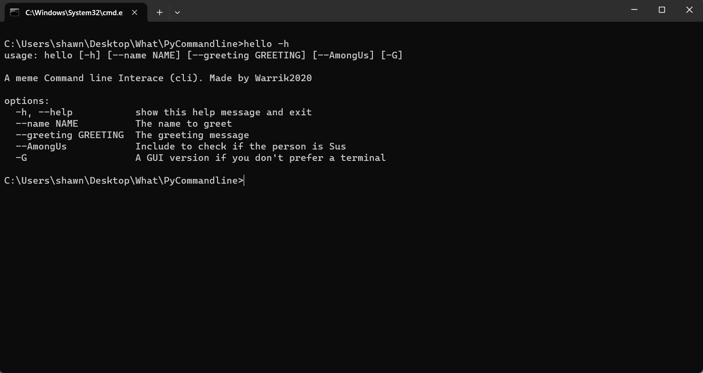

# MCLI
A meme cli!

# About
I was making a cli, and got bored!

Thats it.

# How to install

Heres how to install MCLI

1. Download MCLI
2. 
3. Download GUI

4. Move them to a repository of your choice

5. go to the top of the file manager and instead of "C:\[Whatever]" put cmd

6. now type "hello" and the extension of your choice

# How to use

just do ```hello -h```


